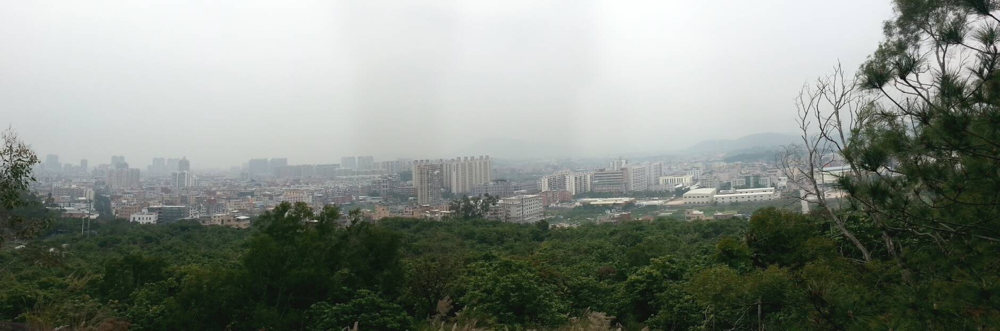

## Hi, I'm Sirasato Aneko!
> 只是一条无名的咸鱼罢了。   
> Just a nameless salted fish.

* Being She/Her as a transgender. However in daily life I prefer They/Them to avoid social problems(I actually don't mind them too much.)
* 18 y.o., Just finished high school and preparing for the next step.
* C++/Python, but I actually forgot them over time. I'll try to pick them up and learn something new.
* Chinese(Mandarin), English.
* Regretfully, I don't use NixOS or eweOS(). I use Debian and KDE Plasma and I enjoys them.
* Still in the onset of bipolar and its treatment. Sorry for any bad experiences.
* Ingress Enlightment Agent.
* PGP: `72F4 E302 D385 CB24 3186 705F 9EEF A177 0CFB AEF5`
* [再会 (VOCALOID ver) - ふたりの - はるまきごはん / 初音ミク](https://music.163.com/#/song?id=1474338672)

> When that day comes, will you present me with a bouquet of flowers?

